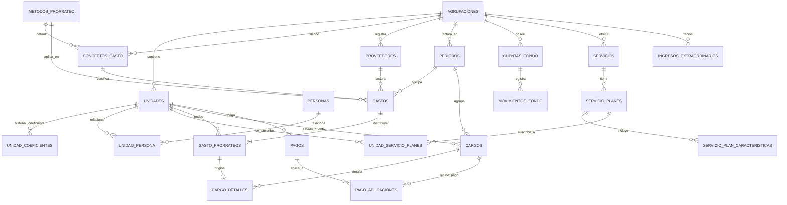

# Diagrama entidad-relación (resumen)

## Flujo funcional

1. Se define la `AGRUPACION` (condominio, mall, coworking, parque industrial) y sus `UNIDADES`,
   cada una con su `UNIDAD_COEFICIENTE` vigente y sus `PERSONAS` asociadas (propietario/arrendatario).
2. Se abre un `PERIODO` (ej. Julio 2026).
3. Se registran `GASTOS` contra `CONCEPTOS_GASTO` (ej. "Vigilancia" → método por defecto
   `COEFICIENTE`), opcionalmente ligados a un `PROVEEDOR`.
4. Al cerrar/prorratear un gasto, el motor de prorrateo (Strategy) genera un `GASTO_PRORRATEO`
   por cada unidad afectada — este registro es inmutable y queda como evidencia auditable.
5. Los `GASTO_PRORRATEOS` del periodo se consolidan en un `CARGO` por unidad (con
   `CARGO_DETALLES`), sumando saldo anterior + intereses de mora si aplica.
6. La unidad paga: se crea un `PAGO`, que se aplica (FIFO) a uno o más `CARGOS` vía
   `PAGO_APLICACIONES`, actualizando el saldo pendiente.
7. Los ingresos que **no** se prorratean a las unidades (parqueadero, alquiler de espacios,
   eventos) van a `INGRESOS_EXTRAORDINARIOS`, y junto con los pagos alimentan el ledger de
   `MOVIMIENTOS_FONDO` sobre una `CUENTA_FONDO` (Caja General, Fondo de Reserva, etc.).
8. Opcionalmente, la `AGRUPACION` ofrece `SERVICIOS` adicionales (TV, comida, hospedaje, etc.)
   organizados en `SERVICIO_PLANES` jerárquicos: cada plan puede heredar en cascada las
   `SERVICIO_PLAN_CARACTERISTICAS` del plan inmediato inferior y sumar las propias. Una
   `UNIDAD` se suscribe a un plan vía `UNIDAD_SERVICIO_PLANES`; la integración de ese cobro al
   ciclo de `CARGOS` todavía no está automatizada.
